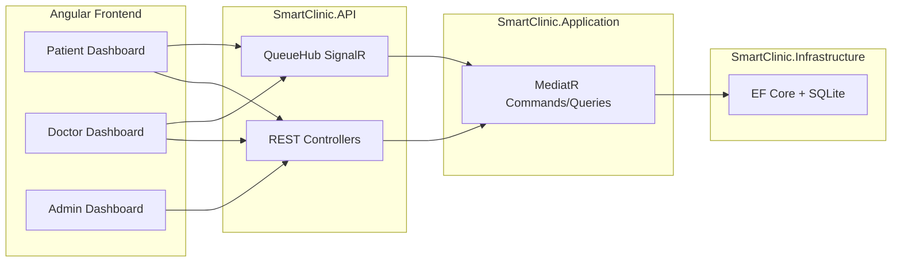

# Smart Clinic

A full-stack **clinic queue and appointment management** system. Patients join a doctor's waiting queue, doctors call the next patient in real time, and admins manage clinics and staff. The backend uses **Clean Architecture** with **CQRS (MediatR)**; the frontend is **Angular 17** with **SignalR** for live updates.

**Repository:** [github.com/MoSamir70/Angular_Smart_Clinic](https://github.com/MoSamir70/Angular_Smart_Clinic)

---

## What This Project Does

| Role | Features |
|------|----------|
| **Patient** (`/patient`) | Register, join a doctor's queue, see position and estimated wait, receive live "you're called" notifications |
| **Doctor** (`/doctor`) | View current queue, call next patient, complete visits |
| **Admin** (`/admin`) | Manage clinics and doctors |

**Core domain:** Clinics, Doctors, Patients, Appointments, Queue Tickets, Notifications.

**Real-time:** SignalR hub at `/hubs/queue` pushes queue updates, ticket calls, and position changes to connected clients.

**API:** REST at `http://localhost:5250/api` — Swagger UI at `http://localhost:5250/swagger` in Development.

---

## Tech Stack

| Layer | Technology |
|-------|------------|
| API | ASP.NET Core 8, Swagger, SignalR |
| Application | MediatR, AutoMapper, FluentValidation |
| Data | Entity Framework Core 8, **SQLite** (local `smartclinic.db`) |
| Frontend | Angular 17, Angular Material, `@microsoft/signalr` |
| Optional (configured, dev-disabled) | Redis backplane, SQL Server, Hangfire |

---

## Project Structure

This repo is a **two-app monorepo**: a .NET backend under `src/` and an Angular SPA under `smart-clinic-frontend/`. Open `SmartClinic.sln` in Visual Studio to work on the backend; the solution also includes a **solution folder** for the frontend entry files (`package.json`, `angular.json`).

```
Smart Clinic/
├── SmartClinic.sln                 # Backend projects + frontend solution folder
├── .gitignore                      # Root ignore rules (.NET, Angular, IDE)
├── src/                            # Backend source of truth (Clean Architecture)
│   ├── SmartClinic.Domain/
│   ├── SmartClinic.Application/
│   ├── SmartClinic.Infrastructure/
│   └── SmartClinic.API/
└── smart-clinic-frontend/          # Angular SPA (run separately with npm)
    └── src/app/
        ├── components/             # patient, doctor, admin dashboards
        ├── services/               # api.service, signalr.service
        └── models/
```

### Opening in Visual Studio

| Item in Solution Explorer | What it is |
|---------------------------|------------|
| `src` → .NET projects | Build and run the API with F5 or `dotnet run` |
| `smart-clinic-frontend` | Solution folder with frontend config files (not a .NET project) |

Run the Angular app from a terminal in `smart-clinic-frontend/` — it is not compiled by the .NET solution.

---

## Prerequisites

- [.NET 8 SDK](https://dotnet.microsoft.com/download) (or newer, e.g. .NET 9 SDK)
- [Node.js](https://nodejs.org/) 18+ and npm

---

## How to Run

Run **backend** and **frontend** in two terminals.

### 1. Backend API

```powershell
cd "d:\Smart Clinic"
dotnet restore SmartClinic.sln
dotnet run --project src\SmartClinic.API\SmartClinic.API.csproj
```

- API: `http://localhost:5250`
- Swagger: `http://localhost:5250/swagger`
- SignalR: `http://localhost:5250/hubs/queue`
- SQLite database is created automatically as `smartclinic.db` in the API working directory.

### 2. Frontend

```powershell
cd "d:\Smart Clinic\smart-clinic-frontend"
npm install
npm start
```

- App: `http://localhost:4200`
- Default route redirects to **Patient** dashboard (`/patient`)

Also available: `/doctor`, `/admin`.

### 3. Verify

1. Open `http://localhost:5250/swagger` and confirm the API is up.
2. Open `http://localhost:4200` — the UI calls `http://localhost:5250/api` and connects to SignalR on port `5250`.
3. Use **Admin** to create a clinic and doctor, then **Patient** to register and join the queue.

---

## API Overview

| Controller | Purpose |
|------------|---------|
| `PatientsController` | CRUD, join queue, queue status |
| `DoctorsController` | CRUD, view queue, call next patient |
| `ClinicsController` | Clinic management |
| `AppointmentsController` | Book, cancel, reschedule |
| `QueueController` | Queue operations (join, complete, cancel) |

---

## Architecture (high level)



---

## Configuration

| Setting | Location | Default (dev) |
|---------|----------|---------------|
| API URL | `smart-clinic-frontend/src/app/services/api.service.ts` | `http://localhost:5250/api` |
| SignalR URL | `smart-clinic-frontend/src/app/services/signalr.service.ts` | `http://localhost:5250/hubs/queue` |
| API port | `src/SmartClinic.API/Properties/launchSettings.json` | `5250` |
| CORS | `Program.cs` | Allows `http://localhost:4200` in Development |

---

## Build for production

```powershell
# Backend
dotnet publish src\SmartClinic.API\SmartClinic.API.csproj -c Release -o ./publish/api

# Frontend
cd smart-clinic-frontend
npm run build
# Output: smart-clinic-frontend/dist/smart-clinic-frontend/
```

Update frontend `baseUrl` and SignalR URL to your deployed API host before production builds.

---

## Future improvements

| Area | Suggestion |
|------|------------|
| Tests | Add `tests/SmartClinic.Tests` for API and application layer |
| Config | Align `appsettings.json` with SQLite dev setup via `appsettings.Development.json` |
| Docker | Optional `docker-compose.yml` for one-command local runs |
| Code cleanup | Reduce large commented blocks in `.csproj` files (keep `Program.cs` history in git) |

---

## License

Not specified in the repository. Add a `LICENSE` file if you plan to open-source or distribute this project.
